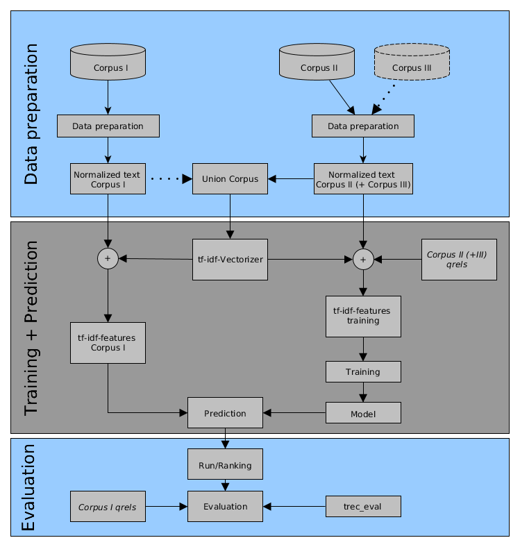
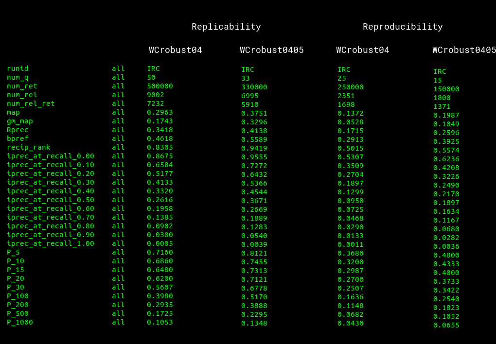

# Replicability and Reproducibility of Automatic Routing Runs
This repository contains our code and run submissions for task 1 & 2 of [CENTRE@CLEF19](https://ceur-ws.org/Vol-2380/paper_258.pdf). Our replicated/reproduced runs `WCRobust04` and `WCRobust0405` are based on this [submission by Grossman and Cormack](https://trec.nist.gov/pubs/trec26/papers/WaterlooCormack-CC.pdf) to TREC Common Core 2017.

:warning: This is a backup of the repository initially hosted on https://bitbucket.org/centre_eval/c2019_irc/.

## Setup instructions
1. Install requirements with pip:
  `pip install -r requirements.txt`

2. Run `python -m nltk.downloader stopwords`

3. Clone [trec_eval](https://github.com/usnistgov/trec_eval), compile it and move the compiled file to the top-level of this repository.

4. Edit config_template.py. Make sure all relative paths are accessible from the top-level of the repository.
  - All path which have to be added are annotated with a TODO-comment

  - Make sure to set all paths for the compressed corpora files, in particular:
    - Washington Post: path to json lines file of Washington Post corpus
    - New York Times: path to compressed files from New York Times corpus (the following folder should be in this directory: data/)
    - TREC45: path to compressed files from TREC disks 4 & 5 (minus cr) (the following folders should be in this directory: fbis/, fr94/, ft/, latimes/)
    - AQUAINT: path to compressed files from AQUAINT corpus (the following folders should be in this directory: apw/, nyt/, xie/)

   - Optionally pre-configured paths can be adapted.

5. Rename config_template.py to config.py

6. From the top-level of this repository run `python -m <task>.<system-name>.main` for producing the respective run. For example, if you want to produce the run for task 1 execute `python -m replicability.wcrobust04.main`

7. If data preparation has already been done in a previous step, it can be
  omitted by setting the parameter `data_prep` to `False`.

8. If the `complete_run` entry in the `config.py`-file remains unedited,
  the run will be found in `artifact/runs/`

## Workflow



## Result

Results from trec_eval are shown below.



## Paper

You can find a copy of the article [here](https://ceur-ws.org/Vol-2380/paper_84.pdf). If you find the work helpful, please cite it as follows.

```
@inproceedings{DBLP:conf/clef/BreuerS19,
  author       = {Timo Breuer and
                  Philipp Schaer},
  editor       = {Linda Cappellato and
                  Nicola Ferro and
                  David E. Losada and
                  Henning M{\"{u}}ller},
  title        = {Replicability and Reproducibility of Automatic Routing Runs},
  booktitle    = {Working Notes of {CLEF} 2019 - Conference and Labs of the Evaluation
                  Forum, Lugano, Switzerland, September 9-12, 2019},
  series       = {{CEUR} Workshop Proceedings},
  volume       = {2380},
  publisher    = {CEUR-WS.org},
  year         = {2019},
  url          = {https://ceur-ws.org/Vol-2380/paper\_84.pdf},
  timestamp    = {Thu, 01 Jun 2023 10:09:02 +0200},
  biburl       = {https://dblp.org/rec/conf/clef/BreuerS19.bib},
  bibsource    = {dblp computer science bibliography, https://dblp.org}
}
```